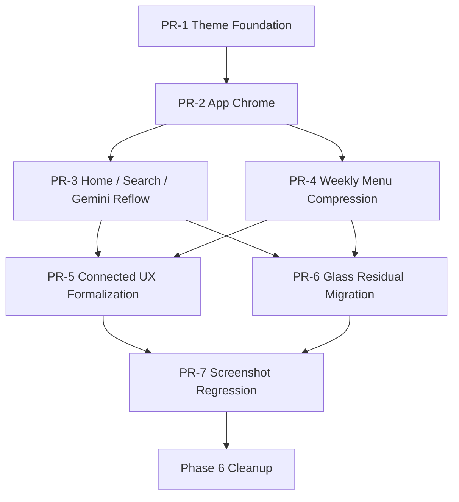

# Phase 5 Out-of-Scope Rationale and Reprioritized Plan

最終更新: 2026-03-07

この文書は、Phase 5 PR-1 の `Out of Scope` に置いた項目について、

- なぜその時点で外したのか
- 今も外すべきか
- 依存関係を踏まえると、どの順で回収するのが最も安全か

を整理したものです。

## 1. 結論

4 項目はすべて「不要」だったのではなく、「その PR でやると手戻り率が高かった」ため外していました。

現時点の扱いは次の通りです。

1. `BottomNav / Header の全面 redesign`
   - これはもう完全な out-of-scope ではありません
   - Theme Foundation 完了後に PR-2 として前倒し実装済みです
2. `Home / WeeklyMenu の情報設計変更`
   - まだ deferred が妥当です
   - ただし Phase 5 の中では最優先です
3. `screenshot regression 導入`
   - まだ deferred が妥当です
   - ただし Phase 5 後半から Phase 6 入口で必要になります
4. `glass class の全面削除`
   - まだ deferred が妥当です
   - これは Phase 5 後半か Phase 6 の cleanup として回収するのが正しいです

## 2. なぜ当時 out-of-scope にしたか

## 2.1 BottomNav / Header の全面 redesign

### 当時外した理由

- Theme token がまだ確定していない段階で app chrome を触ると、同じ UI を 2 回作り直す可能性が高かった
- `BottomNav` と `Header` は全画面に波及するため、1 回の変更で route 全体の smoke が壊れる
- 先に `system / light / dark` と semantic token を固めないと、light/dark の整合性を後から取り直す必要があった

### 定量的な根拠

- `Header`: 97 行
- `BottomNav`: 60 行
- 影響先は全 route
- 当時の smoke は `tests/smoke/app.smoke.spec.ts` の 1 ファイル 14 テストに集中していたため、変更時の失敗原因切り分けが粗かった

### 今の判断

- これはもはや out-of-scope ではない
- Theme Foundation 完了後に PR-2 として実装済み
- ただし、`Header 内の検索/通知/複数スケジュール再統合` まではまだ未着手で、そこだけが residual scope

## 2.2 Home / WeeklyMenu の情報設計変更

### 当時外した理由

- 見た目変更ではなく、ユーザー導線とタスク構造を変える work だから
- 週間献立はロジック分離後でもなお大きく、情報の並び替えだけでなく component 分割と状態設計の変更が必要
- Home は `検索 / AI相談 / 旬 / カテゴリ / 今週の献立` が競合しており、単純な装飾変更では解決しない

### 定量的な根拠

- [HomePage.tsx](/Users/jrmag/my-recipe-app/src/pages/HomePage.tsx): 329 行
- [WeeklyMenuPage.tsx](/Users/jrmag/my-recipe-app/src/pages/WeeklyMenuPage.tsx): 512 行
- 日次主導線は `検索` と `AI相談`
- 週間献立は生成後 UI の縦方向負荷が大きく、単純な style patch では改善量が小さい

### 依存関係

- Header / BottomNav / safe area が先
- テーマ token が先
- `integrationStatus` と QA モードの状態表現がある程度安定していること
- WeeklyMenu は `useWeeklyMenuController` 分離が前提

### 今の判断

- Phase 5 の最優先 backlog
- 見た目より先に、情報量圧縮と CTA の再配置を進めるべき

## 2.3 screenshot regression 導入

### 当時外した理由

- まだ baseline を固定できるほど UI が安定していなかった
- theme foundation 前に screenshot baseline を撮ると、後で大量更新になる
- Google / Gemini / weather / time-dependent UI があり、fixture 戦略なしだと snapshot noise が大きい

### 定量的な根拠

- Playwright の E2E は現状 1 ファイルのみ
  - `tests/smoke/app.smoke.spec.ts`
  - 14 tests
- screenshot test は 0 本
- `toHaveScreenshot` のような visual regression 基盤は未導入

### 依存関係

- theme と app chrome が安定していること
- Home / WeeklyMenu の情報設計が一度落ち着いていること
- QA モードで connected state を再現できること
- weather / clock / async banner の揺らぎを止める test fixture があること

### 今の判断

- すぐには入れない
- ただし、Phase 5 の最後か Phase 6 の入口で必須
- 順番を間違えると baseline 更新作業だけで疲弊する

## 2.4 glass class の全面削除

### 当時外した理由

- これは design change というより cleanup sweep
- 先に semantic token を導入しないと、安全に置換できない
- 画面構造の変更前に全面置換すると、同じ箇所を後でもう一度触る

### 定量的な根拠

- `bg-white/5`: 129 箇所
- `bg-white/10`: 50 箇所
- `ring-white/10|15`: 30 箇所
- `backdrop-blur*`: 12 箇所
- `liquid-background`: 3 箇所

これは 1 PR で雑に消すと、視認性 regressions と diff ノイズが大きすぎます。

### 依存関係

- paired theme token が完成していること
- Home / WeeklyMenu / Gemini / connected UX の最終見た目が固まっていること
- screenshot regression か少なくとも targeted visual QA があること

### 今の判断

- 今すぐ全面削除はしない
- 画面単位で token 化しながら減らす
- 最後に sweep して residual class を消す

## 3. 再優先順位

現状を踏まえると、Phase 5 の残タスクは次の順が最も合理的です。

1. `Home / Search / Gemini Priority Reflow`
2. `Weekly Menu / Shopping Mobile Compression`
3. `Connected UX Formalization`
4. `glass residual migration`
5. `screenshot regression`
6. `Phase 6 cleanup and removal`

## 4. 依存関係つき実装順

## 5. 詳細計画

## PR-3 Home / Search / Gemini Reflow

### 目的

- 日次主導線を `検索` と `AI相談` に寄せる
- 1 スクロール目の迷いを減らす

### 作業

- Home の first viewport を再設計
  - 1: 検索 CTA
  - 2: AI に相談 CTA
  - 3: 今週の献立サマリー
  - 4: 旬 / カテゴリ
- Search の quick filter / recent / history の視覚階層を整理
- Gemini の未設定 / 利用可能 / 制限中 hero を統一

### テスト

- unit:
  - `HomePage.test.tsx`
  - `GeminiEntryState.test.tsx`
- smoke split:
  - `home-priority.spec.ts`
  - `gemini-entry.spec.ts`

### 完了条件

- ホームで `検索` と `AI相談` が 1 スクロール以内
- 未設定でも次の行動が 1 CTA で分かる

## PR-4 Weekly Menu / Shopping Compression

### 目的

- 週間献立をスマホで短く読む
- 今日やることを優先表示する

### 作業

- 今週サマリーを first block に固定
- `今日` カード強調
- 残り 6 日は condensed / accordion 化
- 買い物リストを panel から sheet か route に分離
- fixed action bar を状態依存で絞る

### テスト

- unit/component:
  - `WeeklySummaryCard.test.tsx`
  - `WeeklyActionBar.test.tsx`
  - `WeeklyShoppingSheet.test.tsx`
- smoke split:
  - `weekly-menu-core.spec.ts`
  - `weekly-menu-editing.spec.ts`

### 完了条件

- 生成後の 1 画面目で今週の状態が把握できる
- 買い物導線までのスクロール量が現状より減る

## PR-5 Connected UX Formalization

### 目的

- Google / Gemini の接続済み状態を全画面で同じ文法にする
- QA モードを回帰 harness として正式化する

### 作業

- `integrationStatus` を基準に Account / Calendar / Gemini の状態カードを統一
- QA モードの entry / reset / visible state を整理
- Home / Gemini / Settings で接続状態の見え方を揃える

### テスト

- component:
  - `IntegrationStatusCard.test.tsx`
  - `QaGoogleModeEntry.test.tsx`
- smoke:
  - `connected-google.spec.ts`
  - `connected-gemini.spec.ts`

### 完了条件

- QA モードだけで接続済み主要導線が再現できる
- 本番と QA で状態表現が同一ルールになる

## PR-6 Glass Residual Migration

### 目的

- glass 系 utility を semantic token ベースへ置換する
- 見た目直書きを縮小する

### 作業

- `bg-white/5`, `bg-white/10`, `ring-white/10|15`, `backdrop-blur*` を component 単位で置換
- `liquid-background` 依存を削り、app shell と page shell に分離
- `ui-panel`, `ui-input`, `ui-btn` を使える箇所は寄せる

### テスト

- regression:
  - 주요 reusable component tests 更新
- audit:
  - class usage count を CI レポート化して residual 数を追う

### 完了条件

- glass 系 utility の残数が大幅に減る
- 新規 UI で raw white alpha class を増やさない

## PR-7 Screenshot Regression

### 目的

- paired theme と主要導線の visual regression を固定する

### 作業

- Playwright screenshot baseline を導入
- light / dark 両 theme の固定 fixtures を作る
- QA モード fixture で Google connected state を撮る
- dynamic 要素を止める test hook を追加する

### 対象スクリーン

- Home
- Search
- Gemini
- Weekly Menu
- Settings / Appearance
- Connected Account

### 完了条件

- baseline 更新頻度が低い
- 見た目崩れが smoke ではなく visual diff で先に検知できる

## 6. Phase 6 見越し

Phase 6 は「新しい UI と新しい状態表現が完成したあと、旧資産を消す」フェーズです。

### Phase 6 で消す対象

- 残存 glass class
- 旧 token alias の一部
- 単一 `app.smoke.spec.ts` 依存
- QA モードの暫定 UI 文言や一時的導線
- 旧 layout spacing の重複定義

### Phase 6 のゲート

- PR-3 から PR-7 まで完了
- visual regression baseline が安定
- E2E が `theme / nav / home / weekly / connected` に分割済み

## 7. 実務上の判断

最も大事なのは、`見た目の sweep` より `情報設計の変更` を先にやることです。

理由は単純です。

- Home と WeeklyMenu は、今のボトルネックが「配色」より「情報の並び」
- screenshot regression は、UI が固まる前に入れるとコストだけ先に出る
- glass 全面削除は cleanup であって、UX 改善そのものではない

したがって、次に着手すべきは `PR-3 Home / Search / Gemini Reflow` です。
