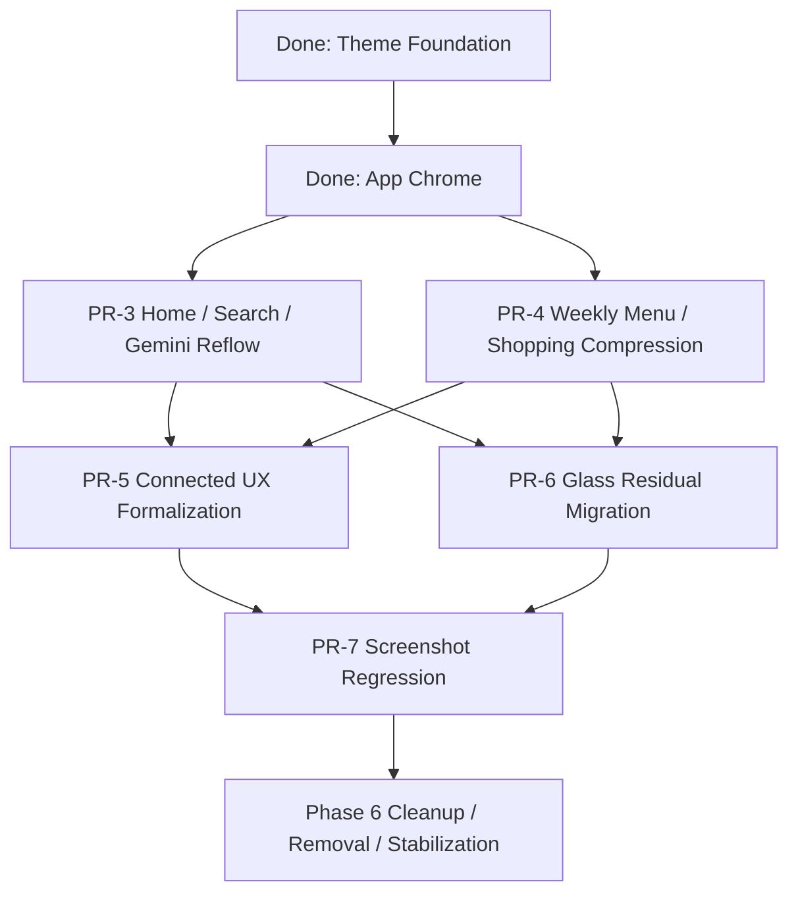

# Phase 5 Remaining Through Phase 6 Execution Plan

最終更新: 2026-03-07

この計画は、現時点で完了済みの作業を前提に、残項目だけを `依存関係 -> 実装順 -> テスト改廃 -> Phase 6 cleanup` の順に並べ直した実行計画です。

## 1. 現在地

完了済み:

- PR-1 `Theme Foundation`
- PR-2 `App Chrome`
- Google QA モードの基盤
- 週間献立 controller 分離の初手
- brittle test 修正

未完了:

- PR-3 `Home / Search / Gemini Priority Reflow`
- PR-4 `Weekly Menu / Shopping Mobile Compression`
- PR-5 `Connected UX Formalization`
- PR-6 `Glass Residual Migration`
- PR-7 `Screenshot Regression`
- Phase 6 `Cleanup / Removal / Stabilization`

## 2. 依存関係

依存関係の理由:

- `Home / Search / Gemini` と `Weekly Menu` は、paired theme と app chrome がないと最終の視覚判断ができない
- `Connected UX` は Home/Gemini/Settings の表示ルールを揃える作業なので、Home/Gemini reflow の後が自然
- `Glass Residual Migration` は cleanup sweep に近く、構造変更後に行わないと二度手間になる
- `Screenshot Regression` は UI 構造がほぼ固定されたあとでないと baseline 更新コストが高すぎる
- `Phase 6` は削除フェーズなので、前段の機能/UI 完成が前提

## 3. 実装順

## PR-3 Home / Search / Gemini Priority Reflow

### 目的

- 日次主要導線を `レシピ検索` と `AI に相談` に寄せる
- ホームの 1 画面目で迷わせない
- Gemini の未設定 / 利用可能 / 制限中を一目で判別できるようにする

### 実装

- [src/pages/HomePage.tsx](/Users/jrmag/my-recipe-app/src/pages/HomePage.tsx) を 4 ブロックへ再構成
  - 検索 CTA
  - AI に相談 CTA
  - 今週の献立サマリー
  - 旬 / カテゴリ / 補助導線
- [src/components/RecipeList.tsx](/Users/jrmag/my-recipe-app/src/components/RecipeList.tsx) の quick filters / recent / history の視覚階層を揃える
- [src/pages/AskGeminiPage.tsx](/Users/jrmag/my-recipe-app/src/pages/AskGeminiPage.tsx) と Gemini tabs を hero-state 主導で整理する
- 検索と AI CTA は 1 スクロール以内に固定する

### テスト

- 追加:
  - `src/pages/__tests__/HomePage.test.tsx`
  - `src/pages/__tests__/AskGeminiPage.test.tsx`
  - `src/components/gemini/__tests__/GeminiEntryState.test.tsx`
- 再編:
  - `tests/smoke/home-priority.spec.ts`
  - `tests/smoke/gemini-entry.spec.ts`
- 維持:
  - `npm run lint`
  - `npm test`
  - `npm run build`
  - `CI=1 npm run test:smoke:ci`

### 完了条件

- ホームの 1 画面目に `検索` と `AI相談` の両方が見える
- Gemini 未設定時に主 CTA が 1 つに絞られている
- 最近の検索 / 最近見たレシピ / quick chips の視認性が light/dark 両方で成立する

## PR-4 Weekly Menu / Shopping Mobile Compression

### 目的

- 週間献立の縦スクロール負荷を下げる
- `今日見るもの` と `後でやるもの` を分離する

### 実装

- [src/pages/WeeklyMenuPage.tsx](/Users/jrmag/my-recipe-app/src/pages/WeeklyMenuPage.tsx) を `summary / today / rest-of-week / shopping` に再構成
- 今日カードを強調し、残り 6 日を condensed list か accordion に変更
- 買い物リストを panel 継ぎ足し表示から sheet か route に分離
- fixed action bar を状態依存で最小化
- share / calendar / shopping result を toast + inline status に統一

### テスト

- 追加:
  - `src/components/weekly/__tests__/WeeklySummaryCard.test.tsx`
  - `src/components/weekly/__tests__/WeeklyActionBar.test.tsx`
  - `src/components/weekly/__tests__/WeeklyShoppingSheet.test.tsx`
- 再編:
  - `tests/smoke/weekly-menu-core.spec.ts`
  - `tests/smoke/weekly-menu-editing.spec.ts`
- 既存 selector の整理:
  - 7 枚フル表示前提の assertion を削減

### 完了条件

- 生成後の 1 画面目で今週の状態が把握できる
- 今日の献立確認から買い物導線までのスクロール量が現状より減る
- 7 日分が同格の長い縦列で並ばない

## PR-5 Connected UX Formalization

### 目的

- Google / Gemini の接続済み体験を同じ UI 文法に揃える
- QA モードを正式な regression harness にする

### 実装

- [src/lib/integrationStatus.ts](/Users/jrmag/my-recipe-app/src/lib/integrationStatus.ts) を単一の状態表現基盤として整理
- [src/components/settings/AccountTab.tsx](/Users/jrmag/my-recipe-app/src/components/settings/AccountTab.tsx)、[src/components/CalendarSettings.tsx](/Users/jrmag/my-recipe-app/src/components/CalendarSettings.tsx)、[src/components/CalendarRegistrationModal.tsx](/Users/jrmag/my-recipe-app/src/components/CalendarRegistrationModal.tsx)、[src/pages/AskGeminiPage.tsx](/Users/jrmag/my-recipe-app/src/pages/AskGeminiPage.tsx) の state card を統一
- QA モードの entry / visible state / reset 操作を整理
- Home / Settings / Gemini で接続状態を同じルールで見せる

### テスト

- 追加:
  - `src/lib/__tests__/integrationStatus.test.ts`
  - `src/lib/__tests__/qaGoogleMode.test.ts`
  - `src/components/settings/__tests__/AccountTab.test.tsx`
  - `src/components/__tests__/CalendarRegistrationModal.test.tsx`
- 再編:
  - `tests/smoke/connected-google.spec.ts`
  - `tests/smoke/connected-gemini.spec.ts`

### 完了条件

- `?qa-google=1` だけで connected flow が再現できる
- QA / 本番 / 失敗系で UI 文法が揃う
- スマホで接続状態を誤認しない

## PR-6 Glass Residual Migration

### 目的

- 残存する glass / white-alpha / ring 直書きを段階的に置換する
- semantic tokens と ui primitives へ寄せる

### 実装

- 優先対象:
  - [src/pages/WeeklyMenuPage.tsx](/Users/jrmag/my-recipe-app/src/pages/WeeklyMenuPage.tsx)
  - [src/components/RecipeDetail.tsx](/Users/jrmag/my-recipe-app/src/components/RecipeDetail.tsx)
  - [src/components/RecipeList.tsx](/Users/jrmag/my-recipe-app/src/components/RecipeList.tsx)
  - [src/components/StockManager.tsx](/Users/jrmag/my-recipe-app/src/components/StockManager.tsx)
  - Settings tabs
- `bg-white/5`, `bg-white/10`, `ring-white/10|15`, `backdrop-blur*`, `liquid-background` を token/class primitive へ置換
- `ui-panel`, `ui-input`, `ui-btn`, `ui-chip` を増やして raw class を減らす
- class usage count を追跡し、削減目標を設定する

### テスト

- 追加:
  - `scripts/ui-class-audit.mjs` を作り、残存 class 数を CI で出す
- 更新:
  - component tests は style 依存 selector を減らす
- 監査:
  - `bg-white/5`, `bg-white/10`, `ring-white/10|15`, `backdrop-blur*` の残数を記録

### 完了条件

- raw white-alpha class の残数が大幅に減る
- 新規 UI は semantic token 以外で面表現を作らない
- `liquid-background` が app shell の必須前提でなくなる

## PR-7 Screenshot Regression

### 目的

- paired theme と主要導線の visual regression を固定する
- Phase 6 cleanup の安全網を作る

### 実装

- Playwright screenshot baseline を導入
- light / dark 両方の固定 fixture を作る
- QA モードで connected state の screenshot も取る
- weather / async banner / loading など揺らぐ要素をテスト用に止める

### 対象画面

- Home
- Search
- Gemini
- Weekly Menu
- Settings / Appearance
- Connected Account

### テスト

- 追加:
  - `tests/visual/theme-home.spec.ts`
  - `tests/visual/search.spec.ts`
  - `tests/visual/gemini.spec.ts`
  - `tests/visual/weekly-menu.spec.ts`
  - `tests/visual/settings-connected.spec.ts`
- package scripts 追加:
  - `test:visual`
  - `test:visual:update`

### 完了条件

- baseline の更新頻度が低い
- 目視レビューではなく visual diff で見た目崩れを拾える

## Phase 6 Cleanup / Removal / Stabilization

### 目的

- 新 UI と新 state 文法へ完全移行し、旧資産を消す
- テスト構成を feature-oriented に再編する

### 実装

- old smoke monolith を分割し、`app.smoke.spec.ts` 依存を終了する
- 旧 token alias / spacing duplicate / glass leftovers を削除
- QA モードの暫定 UI 文言や雑な導線を cleanup
- route/page 単位の shell 重複を減らす
- 必要なら deprecated helper を削除

### テスト改廃

- 廃止:
  - monolithic `tests/smoke/app.smoke.spec.ts`
- 置換:
  - `tests/smoke/navigation.spec.ts`
  - `tests/smoke/home-priority.spec.ts`
  - `tests/smoke/gemini-entry.spec.ts`
  - `tests/smoke/weekly-menu-core.spec.ts`
  - `tests/smoke/weekly-menu-editing.spec.ts`
  - `tests/smoke/connected-google.spec.ts`
  - `tests/smoke/connected-gemini.spec.ts`
- 維持:
  - unit / component / smoke / visual の 4 層

### 完了条件

- 旧 UI 前提 class と token が整理されている
- smoke が feature 単位に分割され、失敗箇所がすぐ分かる
- visual regression が cleanup 後の safety net になっている

## 4. 実装ルール

- 各 PR ごとに `lint / test / build / smoke` を通す
- visual regression は PR-7 以降で `test:visual` を追加
- 破壊的変更は PR-6 以前では避ける
- 片手スマホ操作とスクロール最小化を判断基準の最上位に置く

## 5. 次に着手するもの

承認後の着手順は固定です。

1. PR-3 `Home / Search / Gemini Priority Reflow`
2. PR-4 `Weekly Menu / Shopping Mobile Compression`
3. PR-5 `Connected UX Formalization`
4. PR-6 `Glass Residual Migration`
5. PR-7 `Screenshot Regression`
6. Phase 6 `Cleanup / Removal / Stabilization`
