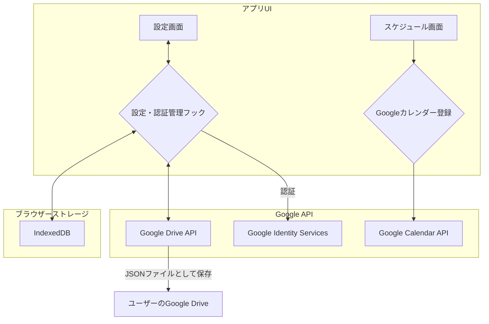

# my-recipe-app 統合リファクタリング計画 v2

## 1. はじめに

この計画は、前回の「設定簡略化リファクタリング計画」に、ユーザーからの新たな要望である「Google連携の簡略化」を統合したものです。

### 1-1. 新たな課題

1.  **Googleログイン/カレンダー登録ボタンの不在**: ユーザーはこれらの機能が存在すると期待していますが、実際には未実装です。
2.  **Supabase設定の複雑さ**: 将来の拡張として`ROADMAP_TO_EXPERT.md`に記載されているSupabaseの導入は、初心者にはハードルが高いと懸念されています。
3.  **よりシンプルな代替案の模索**: 個人データ（在庫、お気に入り、設定）のバックアップ・同期先として、Supabaseよりも手軽なGoogle Driveの活用が提案されました。

### 1-2. 根本原因

-   **機能の未実装**: Googleログイン、カレンダー登録機能は、`ROADMAP_TO_EXPERT.md`のPhase 4で計画されている将来の機能であり、現在のバージョンには実装されていません。アイコンの存在が、機能が実装済みであるかのような誤解を招いています。
-   **クライアントサイド完結アーキテクチャ**: 現在のアプリは、すべてのデータをブラウザ内（IndexedDB）に保存する設計であり、外部サービスとの連携機能（認証、APIアクセス）がありません。

### 1-3. 目標

**「複雑なバックエンドを導入せず、ユーザー自身のGoogleアカウントを活用することで、データ同期と便利機能（カレンダー登録）をシンプルかつ安全に実現する」**

## 2. Supabase vs Google Drive API：代替案の評価

| 観点 | Supabase | Google Drive API (クライアントサイド) | 評価 |
| :--- | :--- | :--- | :--- |
| **設定の容易さ** | プロジェクト作成、スキーマ定義、APIキー設定など手順が多い | Google APIキー設定のみ | **Google Driveの圧勝** |
| **ユーザー体験** | メール/PW登録 or Googleログインが必要 | 普段使っているGoogleアカウントでログインするだけ | **Google Driveがよりシームレス** |
| **コスト** | 無料枠を超えると従量課金 | 無料（Google Driveの保存容量に依存） | **Google Driveが有利** |
| **機能拡張性** | サーバーサイドロジック、リアルタイムDBなど高度な拡張が可能 | ファイルの読み書きに限定される | Supabaseが有利 |
| **今回の要件** | データ同期（バックアップ） | データ同期（バックアップ） | **両者とも要件を満たす** |

**結論**: 今回の「個人のデータを安全にバックアップ・同期したい」という要件に対しては、**Google Drive APIが圧倒的にシンプルで、ユーザーにとってもメリットが大きい**と判断します。

## 3. 統合リファクタリング計画

前回の計画に、Google連携機能を追加します。

### 3-1. 全体アーキテクチャ（変更後）

### 3-2. 実装計画（ステップ・バイ・ステップ）

前回の7ステップに、3つのステップを追加し、一部を修正します。

**【フェーズ1：ローカル設定の改善】** (前回計画のステップ1〜5, 7)

-   **ステップ1**: DBスキーマの更新（変更なし）
-   **ステップ2**: 設定管理フックの作成（変更なし）
-   **ステップ3**: 設定画面のリファクタリング（変更なし）
-   **ステップ4**: APIキー取得ロジックの統一（変更なし）
-   **ステップ5**: ローカルバックアップ機能の実装（変更なし）
-   **ステップ6**: 既存ユーザーのための自動マイグレーション（変更なし）

**【フェーズ2：Google連携機能の実装】** (新規)

-   **ステップ7 (新規)**: Google認証機能の実装
-   **ステップ8 (新規)**: Google Driveへの自動バックアップ機能の実装
-   **ステップ9 (新規)**: Googleカレンダーへの登録機能の実装

**【フェーズ3：クリーンアップ】** (前回計画のステップ6を修正)

-   **ステップ10 (修正)**: `.env`ファイルの削除とドキュメント更新

### 3-3. 詳細な実装手順

#### ステップ7 (新規): Google認証機能の実装

**目的**: Google Identity Servicesを使い、ユーザーがGoogleアカウントでログインし、必要な権限（Drive, Calendar）をアプリに付与できるようにする。

1.  **ライブラリの導入**: `gapi-script`と`@react-oauth/google`を`npm install`します。
2.  **認証フックの作成 (`src/hooks/useGoogleAuth.ts`)**: ログイン状態、ユーザー情報、アクセストークンを管理する`useGoogleAuth`フックを作成します。
3.  **認証ボタンの設置 (`SettingsPage.tsx`)**: 「Googleでログイン」ボタンを設置し、クリックすると`useGoogleAuth`のログイン関数を呼び出します。
4.  **APIキーの設定**: Google Cloud PlatformでOAuth 2.0クライアントIDとAPIキーを取得し、`SettingsPage`で設定できるようにします（これもIndexedDBに保存）。

#### ステップ8 (新規): Google Driveへの自動バックアップ機能の実装

**目的**: 在庫、お気に入り、設定などのユーザーデータを、ユーザーのGoogle Driveに自動でバックアップ・リストアする。

1.  **Drive APIラッパーの作成 (`src/utils/googleDrive.ts`)**: ファイルの検索、作成、更新を行う関数群を作成します。
2.  **自動バックアップ処理**: `useSettings`フックなどを拡張し、設定変更後30秒などのタイマーで、`db`の全データをJSON化し、Google Drive上の`my-recipe-app-data.json`に上書き保存します。
3.  **初回起動時のリストア**: アプリ起動時、Googleログイン済みであれば、Driveから`my-recipe-app-data.json`を読み込み、`db`にリストアします。

#### ステップ9 (新規): Googleカレンダーへの登録機能の実装

**目的**: `MultiScheduleView`で作成した調理スケジュールを、ユーザーのGoogleカレンダーに登録できるようにする。

1.  **カレンダー登録ボタンの追加 (`MultiScheduleView.tsx`)**: ガントチャートの下に「Googleカレンダーに登録」ボタンを追加します。
2.  **イベント作成ロジック**: ボタンがクリックされたら、ガントチャートの各調理工程をGoogle Calendarのイベント形式に変換します。
3.  **API呼び出し**: `gapi.client.calendar.events.insert`を使い、各工程をカレンダーに登録します。

#### ステップ10 (修正): `.env`ファイルの削除とドキュメント更新

-   `.env`ファイルに関する記述をすべて削除します。
-   `README.md`に、「Google Cloud PlatformでAPIキーを取得し、アプリの設定画面で入力してください」という手順を追記します。

## 4. 統合後の実装順序と依存関係

| ステップ | タスク | 依存関係 | 所要時間（目安） |
| :--- | :--- | :--- | :--- |
| 1-6 | ローカル設定の改善 | なし | 7時間 |
| **7** | **Google認証機能の実装** | ステップ1-6 | 3時間 |
| **8** | **Google Driveバックアップ** | ステップ7 | 2時間 |
| **9** | **Googleカレンダー登録** | ステップ7 | 1.5時間 |
| 10 | ドキュメント更新 | ステップ7-9 | 30分 |

**合計所要時間: 約14時間**

## 5. まとめ

この統合リファクタリング計画により、以下の目標を達成できます。

✅ **究極のシンプルさ**: ユーザーはGoogleアカウントでログインするだけで、バックアップやカレンダー登録が利用可能になります。

✅ **脱Supabase**: 複雑なバックエンド設定を回避し、クライアントサイド完結の思想を維持したまま、クラウド連携を実現します。

✅ **機能とUXの向上**: Googleログイン、カレンダー登録という、ユーザーが期待していた機能を提供できます。

この計画は、アプリの利便性を飛躍的に向上させると同時に、技術的な複雑さを最小限に抑えるための最適なアプローチです。
